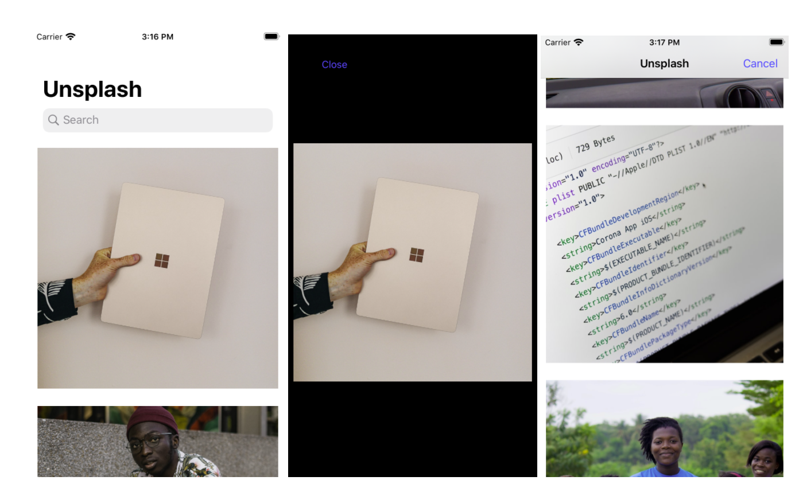
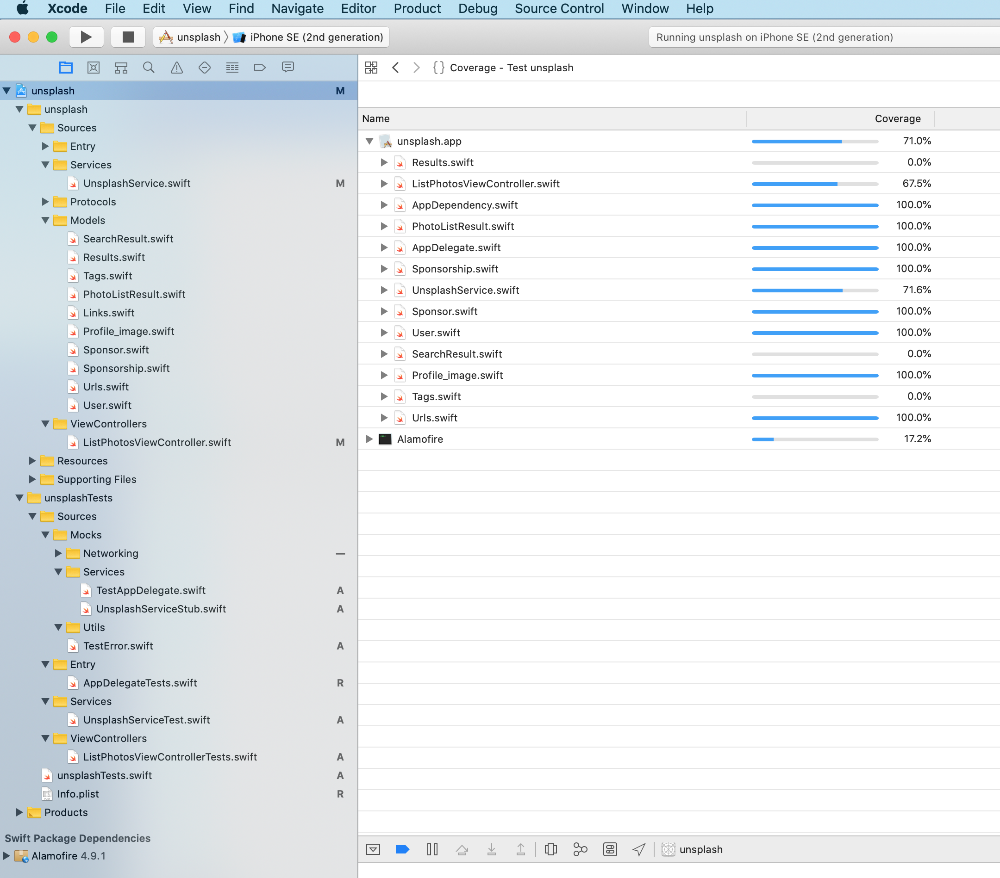

# Unsplash
Unsplash is an search and download photos application written in Swift.

### Screen Shot

### Code Coverage

### 사용된 오픈소스

#### Alamofire

- Alamofire is an HTTP networking library written in Swift.
- https://github.com/Alamofire/Alamofire

## **iOS** 과제

 Unsplash API​ 를 사용하여 다음의 요구사항을 충족하는 앱을 만드세요. 화면은 ​Unsplash

iOS 앱 을 참고해주세요. https://unsplash.com/developers

### 기능**1.** 사진 목록

연관 API: https://unsplash.com/documentation#list-photos (* url encoding 문제로 링크가 제대로 열리지 않을 경우, url을 복사하여 브라우저에서 확인해주세요.)

- 스크롤에 따라 사진이 자동으로 로드되어야 합니다.

- 사진을 터치하면 해당 사진의 상세 화면이 나타납니다.

  

### 기능**2.** 사진 상세보기

- 목록에서 선택한 사진을 보여줍니다.

- 사진 이미지를 좌우로 스와이프하여 사진 목록의 이전/다음 이미지를 볼 수 있습니다.

- 닫기시사진목록으로돌아갑니다.이때,상세에서마지막으로본사진이목록에

  바로 나타나야 합니다. 기능**3.** 사진 검색

  연관 API: https://unsplash.com/documentation#search-photos

- 키워드로 사진을 검색할 수 있어야 합니다.
- 검색후동작은위의기능1,2와동일합니다.

### **iOS**

- 언어: **Swift**

- Deployment Target: iOS 12

- 필요시 외부 라이브러리 사용이 가능하며 (Unsplash와 직접 연관된 라이브러리는

  제외), 사용 시 출처(링크)를 README.md에 포함해 주세요.

### 제출 방법

과제의 형태가 실행파일이므로 zip 파일로 압축하여 보내시는 경우 메일 전송에 어려움이 있을 수 있습니다.
 구글 드라이브​ 혹은 ​개인 **public git repository** 에 다운로드 가능하도록 올려주시고**, url** 을 기재​하여, 메일 회신 (recruit@kakaopaycorp.com) 부탁드립니다.

*특정 open API를 사용하시는 경우, 테스트 가능한 계정이 없으면 확인이 어려운 경우가 있습니다.
 그러한 경우에는 꼭 확인 가능한 계정을 함께 회신 부탁드립니다. (ex.인스타그램 개발자 계정)